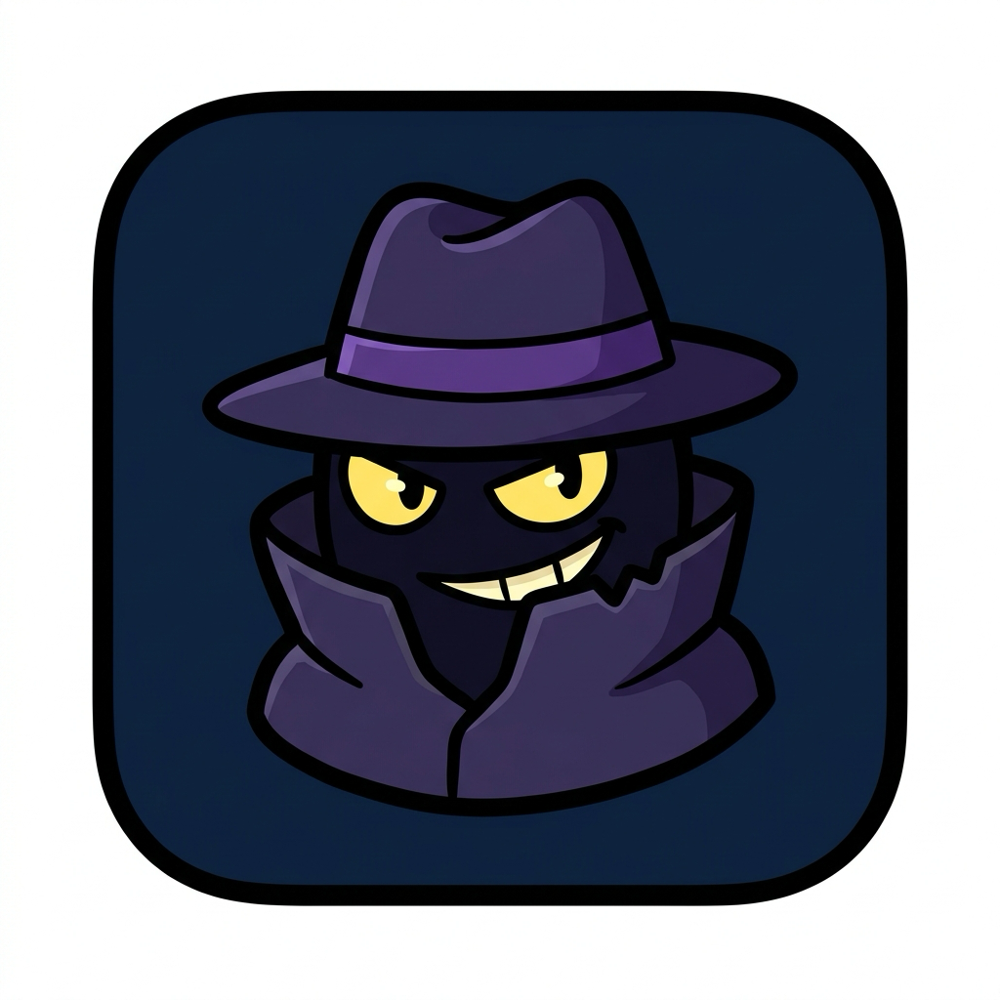
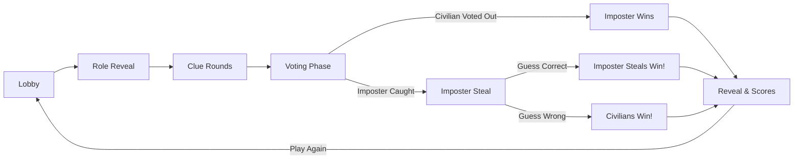

# Imposter Party Game

<p align="center">
  
</p>

<p align="center">
  <strong>A modern, offline-first multiplayer social deduction party game for family and friends.</strong><br>
  <em>Inspired by Undercover, Spyfall, and The Chameleon. Built with FastAPI, WebSockets, React, and Tailwind CSS.</em>
</p>

<p align="center">
  <a href="#-features"></a>
  <a href="https://www.python.org/"></a>
  <a href="https://fastapi.tiangolo.com/"></a>
  <a href="https://react.dev/"></a>
  <a href="https://www.typescriptlang.org/"></a>
  <a href="https://tailwindcss.com/"></a>
  <a href="#-license"></a>
</p>

---

## 📖 Table of Contents

- [Overview](#-overview)
- [Key Features](#-key-features)
- [How to Play](#-how-to-play)
- [Quick Start](#-quick-start)
  - [Option A: One-Click Run Script](#option-a-one-click-run-script)
  - [Option B: Single Standalone Binary](#option-b-single-standalone-binary)
  - [Option C: Docker Container](#option-c-docker-container)
  - [Option D: Manual Developer Setup](#option-d-manual-developer-setup)
- [Project Architecture](#-project-architecture)
- [Custom Word Packs](#-custom-word-packs)
- [Contributing](#-contributing)
- [License](#-license)

---

## 🌟 Overview

**Imposter** is a multiplayer social deduction party game where players are assigned secret words within a shared category. 
Most players are **Civilians** sharing the exact same secret word, but one player is the **Imposter** who received a slightly different (or closely related) word!

Players take turns giving cryptic, one-word clues to prove they belong to the group without tipping off the Imposter. At the end of the clue rounds, everyone votes to eliminate the suspect. If the Imposter is caught, they get one final dramatic chance: **The Imposter Steal** — guess the Civilians' secret word to steal the win!

---

## ✨ Key Features

- 📡 **100% Offline-First & LAN Ready**: Runs anywhere without an active internet connection — home Wi-Fi, college dorms, camping trips, flights, or mobile phone hotspots (iPhone `172.20.10.x`, Android `192.168.43.x`).
- 📷 **Instant QR Code Joining**: Displays an ASCII QR code in your host terminal and a live QR code on the host lobby screen. Players scan with their phone camera to jump straight into the room.
- 🛡️ **Anti-Cheat Wire Protection**: Authoritative server architecture. WebSocket payloads are sanitized per player socket — Civilians cannot inspect network traffic or browser memory to discover the Imposter or hidden words.
- 🔊 **Zero-Asset Procedural Audio**: Procedural sound effects synthesized entirely in code using the browser's native **Web Audio API**. Zero MP3 downloads, instant playback, zero latency.
- 🤖 **Built-in Dev & Practice Bots**: Play alone or fill empty seats with simulated bot players featuring realistic speaking intervals, clue pauses, and automated voting.
- 📦 **Standalone 16 MB Executable**: One-click PyInstaller script bundles Python, FastAPI, and the pre-built React application into a single standalone binary. Zero dependencies required on the host.
- 🌍 **Bilingual Word Packs**: Includes curated English (`words/en.json`) and French (`words/fr.json`) word pairs with categories and hints. Easily extendable with your own custom lists.
- 📱 **Mobile-First Responsive UI**: Dark neon cyber theme with tactile privacy features like the **"Hold to Peek"** secret card to prevent shoulder-surfing.

---

## 🎮 How to Play



1. **Lobby**: Host creates a room (4-letter code) and shares the QR code. Players join from their smartphones. Host can add Dev Bots or tweak game settings (clue rounds, turn timers).
2. **Role Reveal**: Each player uses the **Hold to Peek** card on their screen to privately view their secret role and word.
3. **Clue Rounds**: In turn order, each player speaks a 1-word or short clue aloud.
   - *Civilians*: Prove you know the word without giving it away to the Imposter.
   - *Imposter*: Blend in and pretend you have the same word!
4. **Voting Phase**: Players discuss, accuse, and cast their votes simultaneously on their devices.
5. **The Verdict & Imposter Steal**:
   - If an innocent Civilian is voted out: **Imposter wins!**
   - If the Imposter is caught: The Imposter gets one last guess at the Civilians' word. Guess correctly, and the Imposter **steals the victory**!

---

## 🚀 Quick Start

### Prerequisites

- **Python 3.9+** and [Poetry](https://python-poetry.org/) (for backend)
- **Node.js 18+** and `npm` (for building the client)

---

### Option A: One-Click Run Script

The easiest way to start playing locally:

```bash
git clone https://github.com/otmane-el-aloi/imposter.git
cd imposter

# Automatically builds client (if needed) and launches FastAPI server
./run.sh
```

Open your browser to `http://localhost:8000` (or the LAN IP printed in the terminal). Other players on your Wi-Fi or hotspot scan the QR code printed in the terminal to join instantly!

---

### Option B: Single Standalone Binary

Build a single, portable executable that bundles both the backend and frontend into an all-in-one binary with zero external dependencies:

```bash
chmod +x build_standalone.sh
./build_standalone.sh
```

Your binary is created at `dist/imposter-party` (~16 MB). Run it directly:

```bash
./dist/imposter-party
```

---

### Option C: Docker Container

Run with Docker without needing local Python or Node environments installed:

```bash
# Build the multi-stage Docker image
docker build -t imposter-party .

# Run container on port 8000
docker run -d -p 8000:8000 --name imposter imposter-party
```

Access the game at `http://localhost:8000`.

---

### Option D: Manual Developer Setup

If you want live hot-reloading for both backend and frontend:

#### 1. Backend (Terminal 1)
```bash
poetry install
poetry run python -m backend.main
```

#### 2. Frontend (Terminal 2)
```bash
cd client
npm install
npm run dev
```

---

## 📁 Project Architecture

```
imposter/
├── backend/
│   ├── main.py                  # FastAPI app, LAN IP detector, ASCII QR generator, WebSockets
│   ├── game_manager.py          # State machine, role assignment, turn timers, voting logic, Dev Bots
│   ├── connection_manager.py    # WebSocket multicaster & anti-cheat payload sanitization
│   └── words/
│       ├── en.json              # English word pairs (civilian, imposter, category, hint)
│       └── fr.json              # French word pairs
├── client/
│   ├── src/
│   │   ├── types/game.ts        # Shared TypeScript interfaces & game state types
│   │   ├── hooks/
│   │   │   ├── useGameSocket.ts # WebSocket client with heartbeat & auto-reconnect
│   │   │   └── useSoundEffects.ts # Procedural Web Audio API sound synthesizer
│   │   ├── components/
│   │   │   ├── LobbyView.tsx    # Room creation, player list, QR modal, settings, bots
│   │   │   ├── SecretWordCard.tsx # "Hold to Peek" privacy card
│   │   │   ├── TurnPhase.tsx    # Clue speaker spotlight & turn order strip
│   │   │   ├── VotingPhase.tsx  # Suspect cards, live vote counters, confirm button
│   │   │   └── ResultPhase.tsx  # Imposter Steal input, winner announcement, scoreboard
│   │   ├── App.tsx              # React Router view router
│   │   └── index.css            # Tailwind directives & glow animations
│   ├── package.json
│   └── vite.config.ts
├── tests/
│   ├── test_game_flow.py        # Automated multiplayer loop & anti-cheat wire sanitization
│   ├── test_bot_gameplay.py     # Automated Dev Bot creation, auto-turns, and voting
│   └── test_settings.py         # Clue rounds & timer settings test
├── run.sh                       # One-click start script
├── build_standalone.sh          # One-click standalone executable packager
├── Dockerfile                   # Multi-stage production container build
├── pyproject.toml               # Poetry backend configuration
└── README.md
```

---

## 📚 Custom Word Packs

You can easily add your own word pairs or translate into other languages by editing or creating JSON files in `backend/words/`:

```json
[
  {
    "civilian": "Coffee",
    "imposter": "Tea",
    "category": "Beverages",
    "hint": "Morning beverage"
  },
  {
    "civilian": "Bicycle",
    "imposter": "Motorcycle",
    "category": "Vehicles",
    "hint": "Two-wheeled transportation"
  }
]
```

New JSON files placed in `backend/words/` will automatically be loaded by the server and selectable in the game settings!

---

## 🤝 Contributing

Contributions are welcome! If you'd like to help improve Imposter:

1. Fork the repository
2. Create your feature branch (`git checkout -b feature/awesome-feature`)
3. Commit your changes (`git commit -m 'feat: add awesome feature'`)
4. Push to the branch (`git push origin feature/awesome-feature`)
5. Open a Pull Request

---

## 📄 License

This project is licensed under the **MIT License** — see the [LICENSE](LICENSE) file for details.

<p align="center">
  Made with ❤️ for game nights everywhere. Have fun finding the imposter! 🕵️‍♂️
</p>
